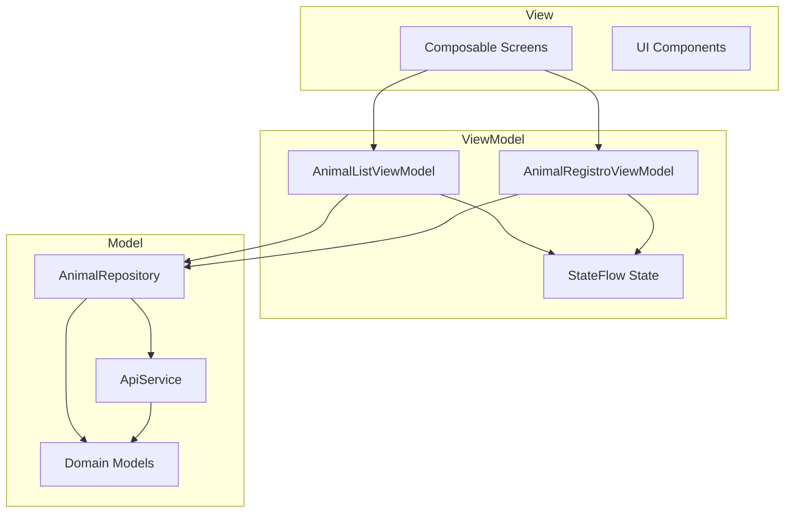
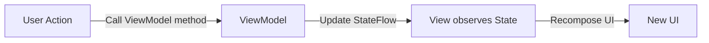

Huellitas implements the **MVVM** (Model-View-ViewModel) pattern to separate UI logic from business logic and data management. This provides:

- **Testable** business logic (ViewModels don't depend on Android framework)
- **Reactive UI** that automatically updates when state changes
- **Lifecycle-aware** state that survives configuration changes
- **Clear separation** between layers

## Architecture Layers



## Model Layer

The Model layer contains domain entities and data access logic.

### Domain Models

Core business entities defined as Kotlin data classes:

```kotlin Animal.kt:19-29
data class Animal(
    val id: String,
    val nombre: String,
    val tipo: TipoAnimal,
    val raza: String,
    val descripcion: String,
    val ubicacion: String,
    val contacto: String,
    val imagenUrl: String? = null,
    val fechaRegistro: Date = Date()
)
```

```kotlin Animal.kt:34-38
enum class TipoAnimal(val etiqueta: String) {
    PERRO("Perro"),
    GATO("Gato"),
    OTRO("Otro")
}
```

These models are:
- **Framework-independent** - Pure Kotlin with no Android dependencies
- **Immutable** - `val` properties prevent accidental mutation
- **Type-safe** - Enum for animal types instead of strings

### Repository Pattern

The Repository acts as a **single source of truth** for data:

```kotlin AnimalRepository.kt:33-37
class AnimalRepository {
    private val api = RetrofitClient.apiService
    private val formatoFecha = SimpleDateFormat("yyyy-MM-dd HH:mm:ss", Locale.getDefault())
    // ...
}
```

Key responsibilities:

1. **Fetch data** from network
2. **Map DTOs** to domain models
3. **Handle errors** and return `Resultado` sealed class
4. **Image processing** (compression, upload)

#### Resultado Pattern

Network operations return a sealed class instead of throwing exceptions:

```kotlin AnimalRepository.kt:24-27
sealed class Resultado<out T> {
    data class Exito<T>(val datos: T) : Resultado<T>()
    data class Error(val mensaje: String) : Resultado<Nothing>()
}
```

Example usage:

```kotlin AnimalRepository.kt:41-53
suspend fun obtenerAnimales(pagina: Int = 1, limite: Int = 10): Resultado<List<Animal>> {
    return try {
        val response = api.listarAnimales(pagina = pagina, limite = limite)
        if (response.isSuccessful && response.body()?.status == true) {
            val lista = response.body()!!.data?.map { it.aModelo() } ?: emptyList()
            Resultado.Exito(lista)
        } else {
            Resultado.Error(response.body()?.message ?: "Error al obtener animales")
        }
    } catch (e: Exception) {
        Resultado.Error("Sin conexión: ${e.localizedMessage}")
    }
}
```

This allows ViewModels to handle success and error cases with type-safe `when` expressions.

## ViewModel Layer

ViewModels manage UI state and coordinate business logic.

### AnimalListViewModel

Manages the animal list screen with pagination and filtering:

```kotlin AnimalListViewModel.kt:26-28
class AnimalListViewModel(
    private val repository: AnimalRepository = AnimalRepository()
) : ViewModel() {
```

#### UI State

State is exposed as `StateFlow` for reactive UI updates:

```kotlin AnimalListViewModel.kt:30-34
private val _estado = MutableStateFlow<EstadoListaAnimales>(EstadoListaAnimales.Cargando)
val estado: StateFlow<EstadoListaAnimales> = _estado.asStateFlow()

private val _isRefreshing = MutableStateFlow(false)
val isRefreshing: StateFlow<Boolean> = _isRefreshing.asStateFlow()
```

State types are sealed classes for exhaustive pattern matching:

```kotlin AnimalListViewModel.kt:16-20
sealed class EstadoListaAnimales {
    data object Cargando : EstadoListaAnimales()
    data class Exito(val animales: List<Animal>) : EstadoListaAnimales()
    data class Error(val mensaje: String) : EstadoListaAnimales()
}
```

#### Loading Data

Data is loaded in `viewModelScope` to automatically cancel when ViewModel is cleared:

```kotlin AnimalListViewModel.kt:55-72
fun cargarAnimales() {
    viewModelScope.launch {
        _estado.value = EstadoListaAnimales.Cargando
        paginaActual = 1
        hayMasPaginas = true
        animalesAcumulados.clear()

        val resultado = fetchPagina(1)
        when (resultado) {
            is Resultado.Exito -> {
                animalesAcumulados.addAll(resultado.datos)
                hayMasPaginas = resultado.datos.size >= limitePorPagina
                _estado.value = EstadoListaAnimales.Exito(animalesAcumulados.toList())
            }
            is Resultado.Error -> _estado.value = EstadoListaAnimales.Error(resultado.mensaje)
        }
    }
}
```

#### Pagination Support

Infinite scroll is implemented with a `cargarMas()` function:

```kotlin AnimalListViewModel.kt:78-96
fun cargarMas() {
    if (_isCargandoMas.value || !hayMasPaginas) return

    viewModelScope.launch {
        _isCargandoMas.value = true
        val siguiente = paginaActual + 1

        when (val resultado = fetchPagina(siguiente)) {
            is Resultado.Exito -> {
                paginaActual = siguiente
                animalesAcumulados.addAll(resultado.datos)
                hayMasPaginas = resultado.datos.size >= limitePorPagina
                _estado.value = EstadoListaAnimales.Exito(animalesAcumulados.toList())
            }
            is Resultado.Error -> { /* No mostrar error, simplemente no agrega más */ }
        }
        _isCargandoMas.value = false
    }
}
```

### AnimalRegistroViewModel

Manages animal registration with form validation and image upload:

```kotlin AnimalRegistroViewModel.kt:31-33
class AnimalRegistroViewModel(
    application: Application
) : AndroidViewModel(application) {
```

Extends `AndroidViewModel` to access `Context` for reading image URIs.

#### Registration State

```kotlin AnimalRegistroViewModel.kt:19-24
sealed class EstadoRegistro {
    data object Inactivo : EstadoRegistro()
    data object Enviando : EstadoRegistro()
    data class Exito(val animal: Animal) : EstadoRegistro()
    data class Error(val mensaje: String) : EstadoRegistro()
}
```

#### Multi-Step Registration

Registration involves two API calls: upload image, then create animal:

```kotlin AnimalRegistroViewModel.kt:86-101
viewModelScope.launch {
    _estadoRegistro.value = EstadoRegistro.Enviando

    // Paso 1: Subir imagen si hay una seleccionada
    var imagenUrl: String? = null
    val uriImagen = _imagenUri.value

    if (uriImagen != null) {
        when (val resultadoImagen = repository.subirImagen(getApplication(), uriImagen)) {
            is Resultado.Exito -> imagenUrl = resultadoImagen.datos
            is Resultado.Error -> {
                _estadoRegistro.value = EstadoRegistro.Error(resultadoImagen.mensaje)
                return@launch
            }
        }
    }
```

If image upload fails, registration stops early. Otherwise, the image URL is passed to animal creation:

```kotlin AnimalRegistroViewModel.kt:103-118
// Paso 2: Crear el animal con la URL de la imagen (si se subió)
_estadoRegistro.value = when (
    val resultado = repository.crearAnimal(
        nombre = nombre,
        idTipoAnimal = idTipo,
        raza = raza,
        descripcion = descripcion,
        ubicacion = ubicacion,
        contacto = contacto,
        imagenUrl = imagenUrl
    )
) {
    is Resultado.Exito -> EstadoRegistro.Exito(resultado.datos)
    is Resultado.Error -> EstadoRegistro.Error(resultado.mensaje)
}
```

## View Layer

Views are Jetpack Compose screens that observe ViewModel state.

### Observing State

StateFlow is collected as Compose State:

```kotlin
val estado by viewModel.estado.collectAsState()
```

UI automatically recomposes when state changes.

### State-Driven UI

UI renders based on current state:

```kotlin
when (estado) {
    is EstadoListaAnimales.Cargando -> {
        Box(Modifier.fillMaxSize()) {
            CircularProgressIndicator(Modifier.align(Alignment.Center))
        }
    }
    is EstadoListaAnimales.Exito -> {
        LazyColumn {
            items(estado.animales) { animal ->
                AnimalCard(animal)
            }
        }
    }
    is EstadoListaAnimales.Error -> {
        ErrorMessage(estado.mensaje)
    }
}
```

### Unidirectional Data Flow



1. User clicks a button
2. UI calls ViewModel method (e.g., `viewModel.cargarMas()`)
3. ViewModel updates internal `_estado` MutableStateFlow
4. Public `estado` StateFlow emits new value
5. Composable collecting the flow recomposes
6. UI reflects new state

## Testing Benefits

MVVM makes testing straightforward:

### ViewModel Tests

```kotlin
@Test
fun `cargarAnimales should update state to Exito on success`() = runTest {
    val mockRepo = mock<AnimalRepository>()
    whenever(mockRepo.obtenerAnimales()).thenReturn(
        Resultado.Exito(listOf(testAnimal))
    )
    
    val viewModel = AnimalListViewModel(mockRepo)
    viewModel.cargarAnimales()
    
    val state = viewModel.estado.value
    assertTrue(state is EstadoListaAnimales.Exito)
    assertEquals(1, (state as EstadoListaAnimales.Exito).animales.size)
}
```

### Repository Tests

```kotlin
@Test
fun `obtenerAnimales returns Error on network failure`() = runTest {
    val mockApi = mock<ApiService>()
    whenever(mockApi.listarAnimales()).thenThrow(IOException())
    
    val repo = AnimalRepository(mockApi)
    val result = repo.obtenerAnimales()
    
    assertTrue(result is Resultado.Error)
}
```

## Best Practices

### Do's

- Use sealed classes for all UI states
- Expose immutable StateFlow to UI
- Keep ViewModels framework-independent (except AndroidViewModel when Context is needed)
- Launch coroutines in `viewModelScope` for automatic cancellation
- Map DTOs to domain models in Repository, never in ViewModel

### Don'ts

- Don't pass Context to regular ViewModels (use AndroidViewModel if needed)
- Don't expose MutableStateFlow publicly (use `.asStateFlow()`)
- Don't perform UI logic in ViewModels (e.g., formatting dates - do this in Composables)
- Don't make ViewModels aware of Navigation (pass callbacks instead)
- Don't use LiveData with Compose (prefer StateFlow)

## Related Pages

- [Architecture Overview](/architecture/overview) - Project structure and design decisions
- [Navigation](/architecture/navigation) - ViewModel sharing between screens
- [Networking](/architecture/networking) - Repository network calls
