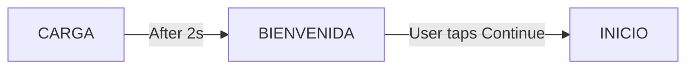
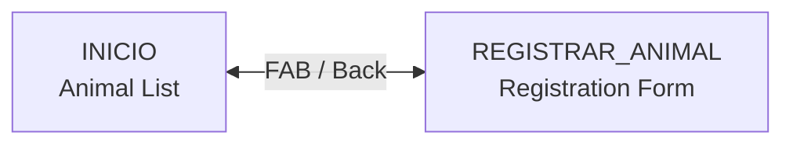
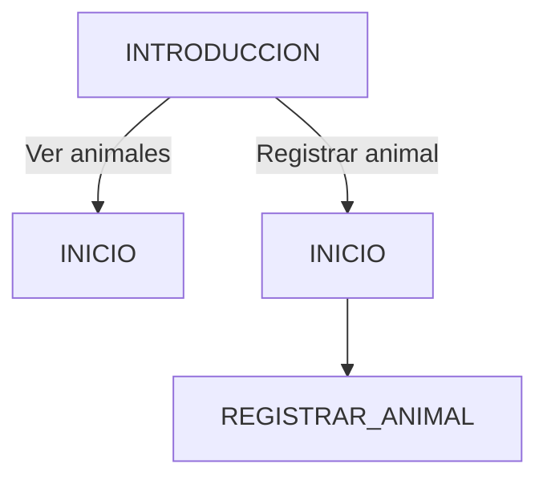

Huellitas uses **Navigation Compose** to manage screen navigation with type-safe routes, smooth animations, and shared ViewModel instances.

## Navigation Setup

Navigation is configured in `NavHostHuellitas` and initialized in `MainActivity`:

```kotlin MainActivity.kt:44-55
@Composable
private fun ContenidoPrincipal() {
    val controladorNav = rememberNavController()

    // TODO: Reemplazar con DataStore para persistencia real entre sesiones
    val estadoBienvenida = rememberSaveable { mutableStateOf(false) }

    NavHostHuellitas(
        controladorNav = controladorNav,
        bienvenidaCompletada = estadoBienvenida.value,
        alCompletarBienvenida = { estadoBienvenida.value = true }
    )
}
```

## Routes Definition

All routes are defined in a sealed object for type safety and centralized management:

```kotlin Routes.kt:7-19
object Rutas {

    // ── Pantalla de carga (Lottie preloader) ──
    const val CARGA = "carga"

    // ── Flujo de bienvenida (solo en primer inicio) ──
    const val BIENVENIDA = "bienvenida"
    const val INTRODUCCION = "introduccion"

    // ── Aplicación principal ──
    const val INICIO = "inicio"
    const val REGISTRAR_ANIMAL = "registrar_animal"
}
```

### Route Organization

Routes are grouped by user flow:

| Route | Screen | When Shown |
|-------|--------|------------|
| `CARGA` | Splash screen with Lottie animation | First launch only |
| `BIENVENIDA` | Welcome screen | First launch only |
| `INTRODUCCION` | Introduction screen | First launch only |
| `INICIO` | Animal list (home) | Main screen |
| `REGISTRAR_ANIMAL` | Animal registration form | When user clicks FAB |

## Navigation Host

The `NavHostHuellitas` composable configures all navigation logic:

```kotlin HuellitasNavHost.kt:35-39
@Composable
fun NavHostHuellitas(
    controladorNav: NavHostController,
    bienvenidaCompletada: Boolean,
    alCompletarBienvenida: () -> Unit
```

### Dynamic Start Destination

The app shows onboarding on first launch, then goes directly to the main screen:

```kotlin HuellitasNavHost.kt:40
val destinoInicial = if (bienvenidaCompletada) Rutas.INICIO else Rutas.CARGA
```

### Shared ViewModel

The `AnimalListViewModel` is created at NavHost level and shared between screens:

```kotlin HuellitasNavHost.kt:44
val listViewModel: AnimalListViewModel = viewModel()
```

This allows the registration screen to refresh the list after creating an animal:

```kotlin HuellitasNavHost.kt:127-135
composable(Rutas.REGISTRAR_ANIMAL) {
    PantallaRegistroAnimal(
        alCompletarRegistro = {
            controladorNav.popBackStack()
            // Recargar la lista en segundo plano al volver del registro
            listViewModel.refrescar()
        }
    )
}
```

## Screen Transitions

All screens use consistent slide + fade animations:

```kotlin HuellitasNavHost.kt:49-72
NavHost(
    navController = controladorNav,
    startDestination = destinoInicial,
    enterTransition = {
        slideInHorizontally(
            initialOffsetX = { ancho -> ancho },
            animationSpec = tween(DURACION_ANIMACION)
        ) + fadeIn(animationSpec = tween(DURACION_ANIMACION))
    },
    exitTransition = {
        slideOutHorizontally(
            targetOffsetX = { ancho -> -ancho },
            animationSpec = tween(DURACION_ANIMACION)
        ) + fadeOut(animationSpec = tween(DURACION_ANIMACION))
    },
    popEnterTransition = {
        slideInHorizontally(
            initialOffsetX = { ancho -> -ancho },
            animationSpec = tween(DURACION_ANIMACION)
        ) + fadeIn(animationSpec = tween(DURACION_ANIMACION))
    },
    popExitTransition = {
        slideOutHorizontally(
            targetOffsetX = { ancho -> ancho },
            animationSpec = tween(DURACION_ANIMACION)
        ) + fadeOut(animationSpec = tween(DURACION_ANIMACION))
    }
```

### Transition Types

- **enterTransition**: When navigating forward (slides in from right)
- **exitTransition**: Previous screen when navigating forward (slides out to left)
- **popEnterTransition**: When navigating back (slides in from left)
- **popExitTransition**: Current screen when navigating back (slides out to right)

Animation duration is 400ms:

```kotlin HuellitasNavHost.kt:20
private const val DURACION_ANIMACION = 400
```

## Navigation Flows

### First Launch Flow



```kotlin HuellitasNavHost.kt:76-84
composable(Rutas.CARGA) {
    PantallaCarga(
        alTerminarCarga = {
            controladorNav.navigate(Rutas.BIENVENIDA) {
                popUpTo(Rutas.CARGA) { inclusive = true }
            }
        }
    )
}
```

The `popUpTo` with `inclusive = true` removes the splash screen from the back stack so the back button doesn't return to it.

### Main App Flow



```kotlin HuellitasNavHost.kt:120-124
composable(Rutas.INICIO) {
    PantallaListaAnimales(
        alNavegarARegistro = { controladorNav.navigate(Rutas.REGISTRAR_ANIMAL) },
        viewModel = listViewModel
    )
}
```

### Onboarding Flow (Alternative)

The introduction screen has two paths:



```kotlin HuellitasNavHost.kt:99-116
composable(Rutas.INTRODUCCION) {
    PantallaIntroduccion(
        alVerAnimales = {
            alCompletarBienvenida()
            controladorNav.navigate(Rutas.INICIO) {
                popUpTo(Rutas.CARGA) { inclusive = true }
            }
        },
        alRegistrarAnimal = {
            alCompletarBienvenida()
            // Navegamos a INICIO primero para tener back stack correcto
            controladorNav.navigate(Rutas.INICIO) {
                popUpTo(Rutas.CARGA) { inclusive = true }
            }
            controladorNav.navigate(Rutas.REGISTRAR_ANIMAL)
        }
    )
}
```

Both paths:
1. Mark onboarding as completed
2. Clear the onboarding screens from back stack
3. Navigate to home (and optionally to registration)

## Navigation Best Practices

### Passing Callbacks, Not NavController

Screens receive navigation callbacks instead of direct access to `NavController`:

```kotlin
// Good
composable(Rutas.INICIO) {
    PantallaListaAnimales(
        alNavegarARegistro = { controladorNav.navigate(Rutas.REGISTRAR_ANIMAL) }
    )
}

// Bad - don't pass NavController to screens
PantallaListaAnimales(navController = controladorNav)
```

Benefits:
- Screens are more testable (no dependency on NavController)
- Clear contract of what navigation actions are available
- Navigation logic stays in NavHost

### Managing Back Stack

Use `popUpTo` to manage back stack and prevent unwanted navigation:

```kotlin
// Remove onboarding screens from back stack
controladorNav.navigate(Rutas.INICIO) {
    popUpTo(Rutas.CARGA) { inclusive = true }
}
```

Without this, pressing back from home would return to the splash screen.

### State Persistence

Currently, the onboarding state is stored in `rememberSaveable`, which survives configuration changes but not app restarts:

```kotlin MainActivity.kt:48
val estadoBienvenida = rememberSaveable { mutableStateOf(false) }
```

For production, this should use **DataStore** or **SharedPreferences**:

```kotlin
// TODO: Implement in MainActivity
val dataStore = context.createDataStore("settings")

val bienvenidaCompletada = dataStore.data
    .map { it[ONBOARDING_COMPLETED] ?: false }
    .collectAsState(initial = false)
```

## Limitations and Future Enhancements

### No Deep Links

The current implementation doesn't support deep linking. To add deep links:

```kotlin
composable(
    route = "animal/{animalId}",
    deepLinks = listOf(navDeepLink { uriPattern = "huellitas://animal/{animalId}" })
) { backStackEntry ->
    val animalId = backStackEntry.arguments?.getString("animalId")
    PantallaDetalleAnimal(animalId)
}
```

### No Type-Safe Navigation

Routes use string constants. For better type safety, consider using:

- **Navigation Compose Type Safety** (requires Kotlin Serialization)
- **Sealed class routes** with navigation arguments

Example with sealed classes:

```kotlin
sealed class Screen {
    object Home : Screen()
    data class AnimalDetail(val id: String) : Screen()
}

// Extension function to navigate
fun NavController.navigate(screen: Screen) {
    when (screen) {
        Screen.Home -> navigate("home")
        is Screen.AnimalDetail -> navigate("animal/${screen.id}")
    }
}
```

### No Bottom Navigation

The current app has a linear navigation flow. For a multi-tab app, add `BottomNavigation` or `NavigationBar` and nested NavHosts.

## Testing Navigation

### NavController Tests

```kotlin
@Test
fun testNavigationToRegistration() {
    val navController = TestNavHostController(ApplicationProvider.getApplicationContext())
    
    composeTestRule.setContent {
        NavHostHuellitas(navController, bienvenidaCompletada = true) {}
    }
    
    // Click FAB to navigate
    composeTestRule.onNodeWithContentDescription("Registrar animal").performClick()
    
    // Verify navigation occurred
    assertEquals(Rutas.REGISTRAR_ANIMAL, navController.currentBackStackEntry?.destination?.route)
}
```

### Back Stack Tests

```kotlin
@Test
fun testOnboardingClearsBackStack() {
    val navController = TestNavHostController(ApplicationProvider.getApplicationContext())
    
    composeTestRule.setContent {
        NavHostHuellitas(navController, bienvenidaCompletada = false) {}
    }
    
    // Complete onboarding
    // ... trigger navigation to INICIO
    
    // Verify back stack doesn't contain CARGA or BIENVENIDA
    val routes = navController.backQueue.map { it.destination.route }
    assertFalse(Rutas.CARGA in routes)
    assertFalse(Rutas.BIENVENIDA in routes)
}
```

## Related Pages

- [Architecture Overview](/architecture/overview) - Single activity pattern
- [MVVM Pattern](/architecture/mvvm-pattern) - Shared ViewModels
