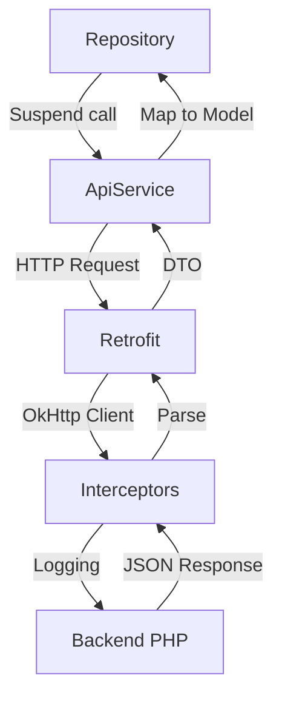

Huellitas uses **Retrofit** + **OkHttp** + **Gson** for REST API communication with the PHP backend.

## Network Stack



## Retrofit Setup

The Retrofit instance is configured in `RetrofitClient` singleton:

```kotlin RetrofitClient.kt:19-47
object RetrofitClient {

    private val loggingInterceptor = HttpLoggingInterceptor().apply {
        level = if (BuildConfig.DEBUG) {
            HttpLoggingInterceptor.Level.BODY
        } else {
            HttpLoggingInterceptor.Level.NONE
        }
    }

    private val httpClient = OkHttpClient.Builder()
        .addInterceptor(loggingInterceptor)
        .connectTimeout(30, TimeUnit.SECONDS)
        .readTimeout(30, TimeUnit.SECONDS)
        .writeTimeout(30, TimeUnit.SECONDS)
        .build()

    private val retrofit: Retrofit by lazy {
        Retrofit.Builder()
            .baseUrl(BuildConfig.BASE_URL)
            .client(httpClient)
            .addConverterFactory(GsonConverterFactory.create())
            .build()
    }

    val apiService: ApiService by lazy {
        retrofit.create(ApiService::class.java)
    }
}
```

### Base URL Configuration

The base URL is injected via `BuildConfig` from `app/build.gradle.kts`:

```kotlin
buildTypes {
    debug {
        buildConfigField("String", "BASE_URL", "\"http://10.0.2.2/huellitas/\"")
    }
    release {
        buildConfigField("String", "BASE_URL", "\"https://webculmapp.com/huellitas/\"")
    }
}
```

- **Debug**: Points to local XAMPP server via emulator IP `10.0.2.2`
- **Release**: Points to production server

This allows seamless switching between local development and production without code changes.

### OkHttp Configuration

#### Logging Interceptor

HTTP requests and responses are logged in debug builds:

```kotlin RetrofitClient.kt:21-27
private val loggingInterceptor = HttpLoggingInterceptor().apply {
    level = if (BuildConfig.DEBUG) {
        HttpLoggingInterceptor.Level.BODY
    } else {
        HttpLoggingInterceptor.Level.NONE
    }
}
```

In debug mode, you'll see full request/response bodies in Logcat:

```
D/OkHttp: --> POST http://10.0.2.2/huellitas/api/animales/crear.php
D/OkHttp: Content-Type: application/json
D/OkHttp: {"nombre":"Firulais","id_tipo_animal":1,...}
D/OkHttp: <-- 200 OK (234ms)
D/OkHttp: {"status":true,"message":"Animal registrado","data":{...}}
```

#### Timeouts

Generous timeouts accommodate slow connections and large image uploads:

```kotlin RetrofitClient.kt:29-34
private val httpClient = OkHttpClient.Builder()
    .addInterceptor(loggingInterceptor)
    .connectTimeout(30, TimeUnit.SECONDS)
    .readTimeout(30, TimeUnit.SECONDS)
    .writeTimeout(30, TimeUnit.SECONDS)
    .build()
```

## API Service Interface

All endpoints are defined in `ApiService`:

```kotlin ApiService.kt:20
interface ApiService {
```

### List Animals

Retrieve paginated animal list with sorting:

```kotlin ApiService.kt:22-28
@GET("api/animales/listar.php")
suspend fun listarAnimales(
    @Query("orden") orden: String = "fecha_registro",
    @Query("direccion") direccion: String = "DESC",
    @Query("pagina") pagina: Int = 1,
    @Query("limite") limite: Int = 10
): Response<ApiResponse<List<AnimalDto>>>
```

**Example request:**
```
GET /api/animales/listar.php?orden=fecha_registro&direccion=DESC&pagina=1&limite=10
```

**Response:**
```json
{
  "status": true,
  "message": "Animales obtenidos exitosamente",
  "data": [
    {
      "id": 1,
      "nombre": "Firulais",
      "tipo_animal": "Perro",
      "raza": "Mestizo",
      "descripcion": "Muy amigable",
      "ubicacion": "Parque Central",
      "contacto": "555-1234",
      "imagen_url": "https://webculmapp.com/huellitas/uploads/firulais.jpg",
      "fecha_registro": "2026-03-04 10:30:00"
    }
  ]
}
```

### Filter by Type

Same endpoint with type filter:

```kotlin ApiService.kt:30-35
@GET("api/animales/listar.php")
suspend fun listarAnimalesPorTipo(
    @Query("tipo") idTipo: Int,
    @Query("pagina") pagina: Int = 1,
    @Query("limite") limite: Int = 10
): Response<ApiResponse<List<AnimalDto>>>
```

**Example:**
```
GET /api/animales/listar.php?tipo=1&pagina=1&limite=10
```

Type IDs: `1` = Dog, `2` = Cat, `3` = Other

### Create Animal

Register a new animal:

```kotlin ApiService.kt:37-40
@POST("api/animales/crear.php")
suspend fun crearAnimal(
    @Body request: CrearAnimalRequest
): Response<ApiResponse<AnimalDto>>
```

**Request body:**
```json
{
  "nombre": "Firulais",
  "id_tipo_animal": 1,
  "raza": "Mestizo",
  "descripcion": "Muy amigable",
  "ubicacion": "Parque Central",
  "contacto": "555-1234",
  "imagen_url": "https://webculmapp.com/huellitas/uploads/firulais.jpg"
}
```

### Upload Image

Upload animal photo as multipart/form-data:

```kotlin ApiService.kt:46-51
@Multipart
@POST("api/animales/subir_imagen.php")
suspend fun subirImagen(
    @Part imagen: MultipartBody.Part,
    @Part("id_animal") idAnimal: RequestBody? = null
): Response<ApiResponse<Map<String, String>>>
```

**Response:**
```json
{
  "status": true,
  "message": "Imagen subida exitosamente",
  "data": {
    "imagen_url": "https://webculmapp.com/huellitas/uploads/1234567890.jpg"
  }
}
```

## Data Transfer Objects (DTOs)

DTOs are separate from domain models and live in `network/dto/`.

### Generic API Response

```kotlin
data class ApiResponse<T>(
    val status: Boolean,
    val message: String,
    val data: T?
)
```

All endpoints return this wrapper with:
- `status`: `true` on success, `false` on error
- `message`: Human-readable message
- `data`: Typed payload (nullable)

### Animal DTO

```kotlin
data class AnimalDto(
    val id: Int,
    val nombre: String?,
    @SerializedName("tipo_animal") val tipoAnimal: String,
    val raza: String?,
    val descripcion: String?,
    val ubicacion: String,
    val contacto: String,
    @SerializedName("imagen_url") val imagenUrl: String?,
    @SerializedName("fecha_registro") val fechaRegistro: String
)
```

`@SerializedName` maps JSON snake_case to Kotlin camelCase.

## Repository Pattern

The Repository abstracts network calls and maps DTOs to domain models.

### Fetching Animals

```kotlin AnimalRepository.kt:41-53
suspend fun obtenerAnimales(pagina: Int = 1, limite: Int = 10): Resultado<List<Animal>> {
    return try {
        val response = api.listarAnimales(pagina = pagina, limite = limite)
        if (response.isSuccessful && response.body()?.status == true) {
            val lista = response.body()!!.data?.map { it.aModelo() } ?: emptyList()
            Resultado.Exito(lista)
        } else {
            Resultado.Error(response.body()?.message ?: "Error al obtener animales")
        }
    } catch (e: Exception) {
        Resultado.Error("Sin conexión: ${e.localizedMessage}")
    }
}
```

### DTO to Domain Mapping

```kotlin AnimalRepository.kt:156-178
private fun AnimalDto.aModelo(): Animal {
    val tipo = when (tipoAnimal.lowercase(Locale.getDefault())) {
        "perro" -> TipoAnimal.PERRO
        "gato"  -> TipoAnimal.GATO
        else    -> TipoAnimal.OTRO
    }
    val fecha: Date = try {
        formatoFecha.parse(fechaRegistro) ?: Date()
    } catch (e: Exception) {
        Date()
    }
    return Animal(
        id = id.toString(),
        nombre = nombre ?: "",
        tipo = tipo,
        raza = raza ?: "",
        descripcion = descripcion ?: "",
        ubicacion = ubicacion,
        contacto = contacto,
        imagenUrl = imagenUrl,
        fechaRegistro = fecha
    )
}
```

Mapping logic:
- Converts string type to enum
- Parses date string to `Date` object
- Provides default values for nullable fields
- Maps server ID (Int) to domain ID (String)

## Error Handling

### Resultado Sealed Class

All network operations return a `Resultado` type:

```kotlin AnimalRepository.kt:24-27
sealed class Resultado<out T> {
    data class Exito<T>(val datos: T) : Resultado<T>()
    data class Error(val mensaje: String) : Resultado<Nothing>()
}
```

This provides type-safe error handling without exceptions:

```kotlin
when (val resultado = repository.obtenerAnimales()) {
    is Resultado.Exito -> mostrarAnimales(resultado.datos)
    is Resultado.Error -> mostrarError(resultado.mensaje)
}
```

### Error Sources

1. **Network errors** (no internet, timeout):
```kotlin
catch (e: Exception) {
    Resultado.Error("Sin conexión: ${e.localizedMessage}")
}
```

2. **HTTP errors** (4xx, 5xx):
```kotlin
if (!response.isSuccessful) {
    Resultado.Error(response.body()?.message ?: "Error HTTP ${response.code()}")
}
```

3. **API errors** (200 OK but status=false):
```kotlin
if (response.body()?.status != true) {
    Resultado.Error(response.body()?.message ?: "Error del servidor")
}
```

## Image Upload

Image uploads require special handling for multipart requests.

### Compression

Images are compressed before upload to reduce bandwidth:

```kotlin AnimalRepository.kt:184-222
private fun comprimirImagen(bytesOriginal: ByteArray): ByteArray {
    val opciones = BitmapFactory.Options().apply { inJustDecodeBounds = true }
    BitmapFactory.decodeByteArray(bytesOriginal, 0, bytesOriginal.size, opciones)

    val anchoOriginal = opciones.outWidth
    val altoOriginal = opciones.outHeight
    val ladoMax = 1280

    // Calcular inSampleSize para reducir memoria al decodificar
    var inSampleSize = 1
    if (anchoOriginal > ladoMax || altoOriginal > ladoMax) {
        val mitadAncho = anchoOriginal / 2
        val mitadAlto = altoOriginal / 2
        while (mitadAncho / inSampleSize >= ladoMax && mitadAlto / inSampleSize >= ladoMax) {
            inSampleSize *= 2
        }
    }

    // ... scale bitmap and compress to JPEG at 75% quality
}
```

Compression reduces file size from ~5-10MB (CameraX raw) to ~100-300KB.

### Multipart Request

```kotlin AnimalRepository.kt:112-135
suspend fun subirImagen(context: Context, uri: Uri): Resultado<String> {
    return try {
        val contentResolver = context.contentResolver
        val inputStream = if (uri.scheme == "file") {
            val archivo = java.io.File(requireNotNull(uri.path))
            java.io.FileInputStream(archivo)
        } else {
            contentResolver.openInputStream(uri)
        } ?: return Resultado.Error("No se pudo leer la imagen seleccionada.")

        val bytes = comprimirImagen(inputStream.readBytes())
        inputStream.close()

        val requestBody = bytes.toRequestBody("image/jpeg".toMediaTypeOrNull())
        val multipart = MultipartBody.Part.createFormData(
            "imagen",
            "foto_animal.jpg",
            requestBody
        )

        val response = api.subirImagen(multipart)
        if (response.isSuccessful && response.body()?.status == true) {
            val url = response.body()!!.data?.get("imagen_url")
                ?: return Resultado.Error("No se recibió la URL de la imagen.")
            Resultado.Exito(url)
        } else {
            Resultado.Error("Error al subir la imagen")
        }
    } catch (e: Exception) {
        Resultado.Error("Error al subir imagen: ${e.localizedMessage}")
    }
}
```

### URI Handling

The function handles both:
- **Content URIs** (`content://`) from gallery picker
- **File URIs** (`file://`) from CameraX internal storage

## Network Security

### HTTPS in Production

Production builds use HTTPS to encrypt traffic:

```kotlin
buildConfigField("String", "BASE_URL", "\"https://webculmapp.com/huellitas/\"")
```

### Cleartext Traffic (Debug Only)

Debug builds allow HTTP to localhost. Configure in `AndroidManifest.xml`:

```xml
<application
    android:usesCleartextTraffic="true">
```

**Warning**: Never enable `usesCleartextTraffic` in production builds.

## Testing Network Layer

### Mock ApiService

```kotlin
@Test
fun `obtenerAnimales returns success with valid response`() = runTest {
    val mockApi = mock<ApiService>()
    val dto = AnimalDto(
        id = 1,
        nombre = "Test",
        tipoAnimal = "Perro",
        // ...
    )
    val response = Response.success(
        ApiResponse(status = true, message = "OK", data = listOf(dto))
    )
    whenever(mockApi.listarAnimales()).thenReturn(response)
    
    val repo = AnimalRepository(mockApi)
    val result = repo.obtenerAnimales()
    
    assertTrue(result is Resultado.Exito)
    assertEquals(1, (result as Resultado.Exito).datos.size)
}
```

### Mock Server

Use MockWebServer for integration tests:

```kotlin
val mockServer = MockWebServer()
mockServer.enqueue(
    MockResponse()
        .setResponseCode(200)
        .setBody("""{"status":true,"data":[]}""")
)

val retrofit = Retrofit.Builder()
    .baseUrl(mockServer.url("/"))
    .addConverterFactory(GsonConverterFactory.create())
    .build()

val api = retrofit.create(ApiService::class.java)
```

## Performance Optimizations

### Pagination

All list endpoints support pagination to reduce payload size:

```kotlin
api.listarAnimales(pagina = 1, limite = 10)  // Load 10 items
api.listarAnimales(pagina = 2, limite = 10)  // Load next 10
```

### Image Compression

Images are compressed to 1280px max dimension at 75% JPEG quality, reducing upload time and server storage.

### Connection Pooling

OkHttp automatically pools HTTP connections for faster subsequent requests.

### Caching

Currently, there's no HTTP caching. For offline support, add:

```kotlin
val cacheSize = 10 * 1024 * 1024 // 10 MB
val cache = Cache(context.cacheDir, cacheSize.toLong())

val httpClient = OkHttpClient.Builder()
    .cache(cache)
    .addNetworkInterceptor(CacheInterceptor())
    .build()
```

## Related Pages

- [Architecture Overview](/architecture/overview) - Data flow and backend endpoints
- [MVVM Pattern](/architecture/mvvm-pattern) - Repository usage in ViewModels
