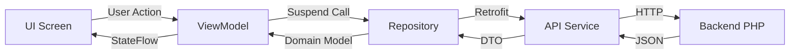

Huellitas follows a modern Android architecture using **MVVM** (Model-View-ViewModel) with a single-activity pattern and Jetpack Compose for UI.

## Project Structure

The app is organized into clear, domain-separated packages:

```
com.example.huellitas/
├── model/              # Data models (Animal, TipoAnimal, OpcionFiltro)
├── navigation/         # Navigation routes and NavHost
├── network/            # Retrofit client, ApiService, DTOs
├── repository/         # Data layer (AnimalRepository)
├── ui/
│   ├── components/     # Reusable Compose components
│   ├── screens/        # Feature screens
│   │   ├── camera/     # Camera capture (CameraX)
│   │   ├── home/       # Animal list screen
│   │   ├── onboarding/ # Welcome and intro
│   │   ├── registration/ # Animal registration form
│   │   └── splash/     # Splash screen with Lottie
│   └── theme/          # Material 3 theme configuration
├── viewmodel/          # ViewModels (state management)
└── MainActivity.kt     # Single activity entry point
```

## MVVM Layers

Huellitas separates concerns into three main layers:

### Model

Defines the domain entities and business logic:

- `Animal.kt` - Core data class representing a street animal
- `TipoAnimal.kt` - Enum for animal types (Dog, Cat, Other)
- DTOs in `network/dto/` - API response mapping

### View

Jetpack Compose UI screens that observe ViewModel state:

- `PantallaListaAnimales` - Animal list with filters and infinite scroll
- `PantallaRegistroAnimal` - Registration form with camera integration
- `PantallaCarga` - Lottie splash animation
- Reusable components in `ui/components/`

### ViewModel

Manages UI state and business logic:

- `AnimalListViewModel` - List state, pagination, filtering
- `AnimalRegistroViewModel` - Form validation, image upload, submission

See [MVVM Pattern](/architecture/mvvm-pattern) for detailed implementation.

## Single Activity Pattern

Huellitas uses a **single-activity architecture** with Navigation Compose:

```kotlin MainActivity.kt:20-30
class MainActivity : ComponentActivity() {
    override fun onCreate(savedInstanceState: Bundle?) {
        super.onCreate(savedInstanceState)
        enableEdgeToEdge()
        setContent {
            HuellitasTheme {
                ContenidoPrincipal()
            }
        }
    }
}
```

All screens are Composable functions managed by `NavHostHuellitas`. This provides:

- Simplified lifecycle management
- Shared ViewModel instances across screens
- Smooth animated transitions
- Type-safe navigation with sealed Routes

Learn more in [Navigation](/architecture/navigation).

## Data Flow



1. **UI** calls ViewModel methods (e.g., `registrarAnimal()`)
2. **ViewModel** validates input and calls Repository
3. **Repository** makes network calls via Retrofit
4. **API response** is mapped from DTO to domain model
5. **ViewModel** updates StateFlow with success/error
6. **UI** recomposes automatically observing state

## Technology Stack

| Technology | Purpose | Location |
|------------|---------|----------|
| **Kotlin** | Primary language | All `.kt` files |
| **Jetpack Compose** | Declarative UI | `ui/` package |
| **Material 3** | Design system | `ui/theme/` |
| **Navigation Compose** | Screen routing | [navigation/](/architecture/navigation) |
| **Retrofit + OkHttp** | HTTP client | [network/](/architecture/networking) |
| **Gson** | JSON parsing | Network layer |
| **Coroutines** | Async operations | ViewModels, Repository |
| **StateFlow** | Reactive state | ViewModel → UI |
| **Coil** | Image loading | UI components |
| **CameraX** | Photo capture | `screens/camera/` |
| **Lottie** | Splash animation | `screens/splash/` |

## Key Design Decisions

### Sealed Classes for State

All screen states use sealed classes for type-safe state management:

```kotlin AnimalListViewModel.kt:16-20
sealed class EstadoListaAnimales {
    data object Cargando : EstadoListaAnimales()
    data class Exito(val animales: List<Animal>) : EstadoListaAnimales()
    data class Error(val mensaje: String) : EstadoListaAnimales()
}
```

This enables exhaustive `when` expressions and prevents invalid states.

### Resultado Pattern for Network Calls

Network operations return a sealed `Resultado` type instead of throwing exceptions:

```kotlin AnimalRepository.kt:24-27
sealed class Resultado<out T> {
    data class Exito<T>(val datos: T) : Resultado<T>()
    data class Error(val mensaje: String) : Resultado<Nothing>()
}
```

See [Networking](/architecture/networking) for error handling details.

### ViewModel Sharing

The `AnimalListViewModel` is shared between the list screen and registration callback to automatically refresh the list after adding an animal:

```kotlin HuellitasNavHost.kt:44
val listViewModel: AnimalListViewModel = viewModel()
```

## Backend Integration

The app connects to a PHP REST API:

- **Debug**: `http://10.0.2.2/huellitas/` (local XAMPP)
- **Release**: `https://webculmapp.com/huellitas/` (production)

Base URL is configured in `app/build.gradle.kts` via `buildConfigField`.

### Main Endpoints

| Method | Endpoint | Description |
|--------|----------|-------------|
| GET | `/api/animales/listar.php` | List animals with pagination and filters |
| POST | `/api/animales/crear.php` | Register a new animal |
| POST | `/api/animales/subir_imagen.php` | Upload animal photo |

See [Networking](/architecture/networking) for complete API documentation.

## Next Steps

- [MVVM Pattern](/architecture/mvvm-pattern) - Detailed ViewModel and state management
- [Navigation](/architecture/navigation) - Routes and screen transitions
- [Networking](/architecture/networking) - Retrofit setup and API integration
